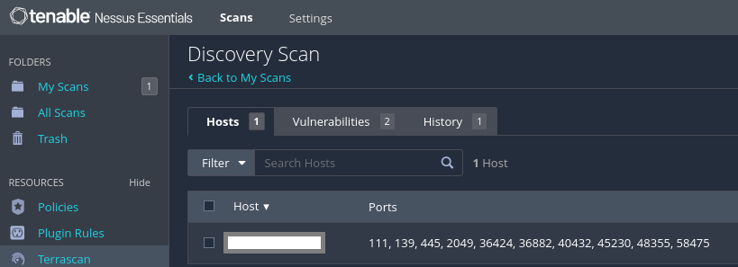
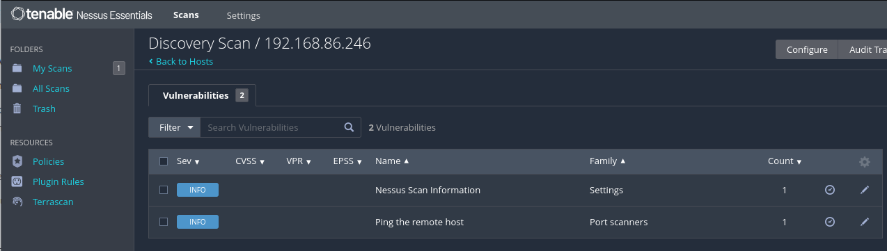
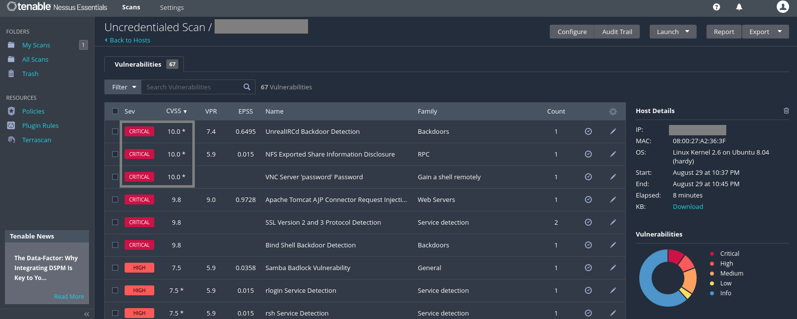
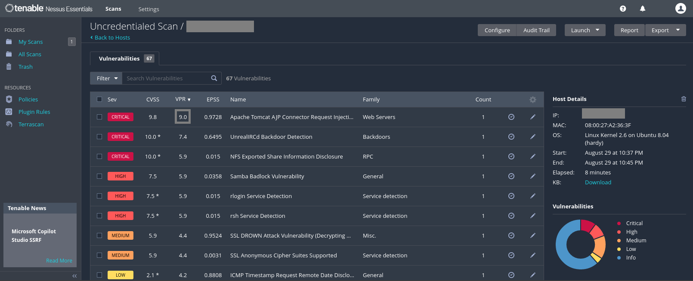
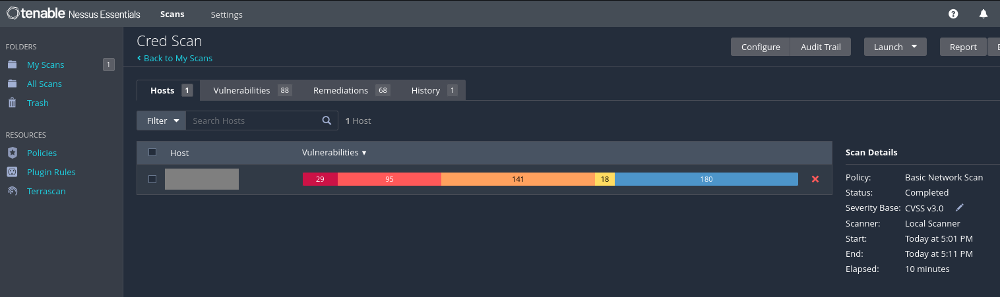
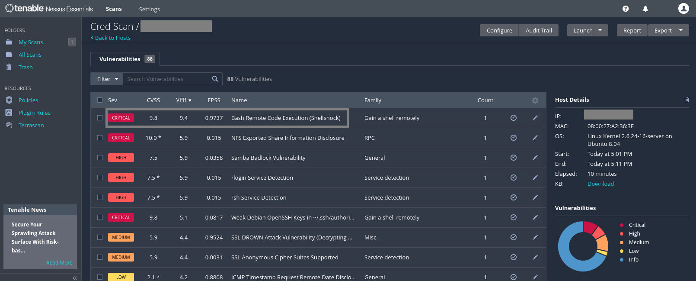
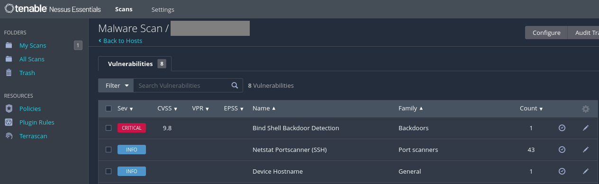
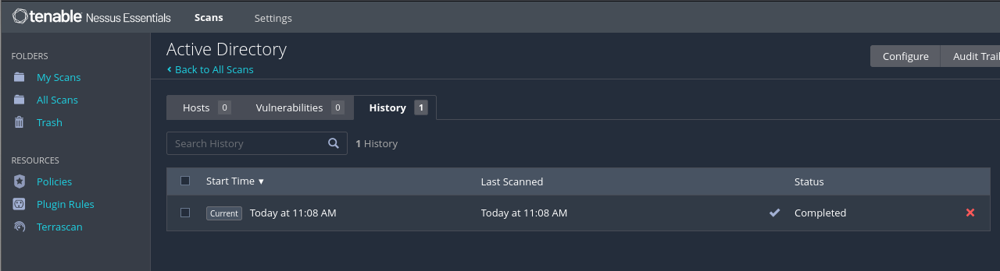

# Nessus Essential Scan on Metasploitable 2

This project involves using Nessus Essential to perform a vulnerability assessment on the Metasploitable 2 virtual machine. The purpose is to identify and analyze security weaknesses in a controlled environment using the free version of Nessus.  

## Tools Used
- **Nessus Essential**: A free tool for identifying security vulnerabilities and weaknesses in systems and applications.  
- **Kali Linux**: A penetration testing distribution used to run Nessus.  
- **Metasploitable 2**: A vulnerable virtual machine used for testing and training.  

## Overview
The project includes:  
- Configuration of Nessus on Kali Linux.  
- Scanning of the Metasploitable 2 machine.  
- Analysis of the vulnerability report generated.  

## Getting Started
1. Set up Kali Linux and install Nessus.
  - Downloaded and installed [Kali Linux](https://www.kali.org/get-kali/#kali-installer-images) in [VirtualBox](https://www.virtualbox.org/wiki/Downloads).
  - Signed up for [Nusses Essentials](https://www.tenable.com/products/nessus/nessus-essentials).
    -  Opened Terminal in Kali Linux and installed Nessus using the following [guide](https://docs.tenable.com/nessus/Content/InstallNessusLinux.htm).
    -  Started Nessus using the command 'sudo service nessusd start'.
      - When using the command I was asked to enter my Kali Linux password.
    -  Did *ifconfig* to get IP of Kali Linux virtual machine.
  - Accessed Nessus via 'https://localhost:8834'.
    - Set up an account and activated Nessus Essentials using the activation code from signup.
     
2. Deploy Metasploitable 2.
    - Downloaded and installed [Metasploitable 2](https://sourceforge.net/projects/metasploitable/) in VirtualBox.
    - Signed in using default credentials (msfadmin/msfadmin).
    - Did *ifconfig* to get IP of Metasploitable 2 virtual machine.
    - Ran a ping command test to verify connection between the two devices.  
     
3. Perform the vulnerability scan using Nessus.  
    - Pressed on **New Scan** on the right side of the screen and was given a couple of Scan Templates to choose from.
    - The **first** scan I did was a **Host Discovery** scan found under the **Discovery** template. I entered the IP address of the Metasploitable 2 virtual machine in the **Targets** field and ran the scan. It took a few minutes and I was able to see the results after.
    - The **second** scan I did was a **Basic Network Scan** found under the **Vulnerabilities** template. I did the same thing and entered the IP address of the Metasploitable 2 virtual machine in the **Targets** field and ran the scan. It also looks like theres was a tab for Credentials. I ran the scan without adding Credentials this time around.
    - The **third** scan I did was also the **Basic Network Scan**. This time I entered the IP address in the **Targets** field then clicked on the Credentials tab. I wasn't sure what to do in the Credentials tab so I looked it up a quick guide on what could be done in it. I was then able to use the Metasploitable 2 Credentials for this scan by clicking on the SSH section under the categories. I changed the Authentication method to password and filled in the *Username* and *Password* field using the login default credentials of (msfadmin/msfadmin). I clicked on save and then ran the scan. This scan took a lot longer than the scan before but I think it's because it was able to use the credentials to ran a more detailed and thorough scan.
    - The **fourth** scan I did was a **Malware Scan** also found under the **Vulnerabilities** template. I entered the same information as I did for the Credential scan prior and ran it.
    - The **fifth** scan I did was the **Active Directory Starter Scan**. I entered the IP address in the **Targets** field and nothing in the Credentials tab and ran the scan.  
     
4. Review the scan results to identify potential security issues.  
    - The first scan from the Host Discovery scan resulted in 2 Vulnerabilities. One of them was 'Nessus Scan Information' and it showed the information about the scan itself. The other one was 'Ping the remote host' which Nessus determines if a remote host is active using ARP, ICMP, TCP, or UDP pings.  
    
      
      
       
    - The second scan results from the Basic Network scan that I did not include credentials to had 67 Vulnerabilities. This scan was different in that it had different severity levels from Critical, High, Medium, Low, Mixed, and Info. It also had CVSS (Common Vulnerability Scoring System) values that ranges from 10 (highest) to 1 (lowest). There was 4 Critical Vulnerabilities with a CVSS score of 10. It also had VPR (Vulnerability Priority Rating) values that has the same range as CVSS but focuses more on practical risk and urgency. In the scan, the highest was a value of 9.0 with a name of 'Apache Tomcat AJP Connector Request Injection (Ghostcat)'. When I clicked into it to find out more, it said that a remote, unauthenticated attacker could exploit and read web applications. Another metric was the EPSS (Exploit Prediction Scoring System) that predicts the likelihood that a vulnerability will be exploited. This has a range of 0 to 1 with a higher value indicating a greater likelihood of exploitation.  
    
      
      
      
     
    - The third scan was also a Basic Network scan but this time used Credentials. It resulted in a lot more vulnerabilities and more remediations compared to the Uncredentialed scan. When I clicked into it, I sorted each metric from high to low and noticed that there is a vulnerability with a CVSS of 9.8, VPR of 9.4 and EPSS of 0.9737 named 'Bash Remote Code Execution (Shellshock)'. That means this vulnerability has a high threat intensity and a high likelihood of it being exploited. The description of the vulnerability is that a remote host is running a version of Bash that is vulnerable to command injection and could remotely execute arbitrary code.  
    
      
      
     
    - The fourth scan results from the Malware Scan didn't have much although this virtual machine is designed to have a bunch of vulnerabilities for penetration and security training. The results I found was that it had 1 critical vulnerability named 'Bind Shell Backdoor Detection' with a CVSS severity of 9.8. The description is that *a shell is listening on the remote port without any authentication required*. Since the backdoor is open on this machine, anyone can connect in and start sending commands directly.  
    
      
     
    - The last scan I did was an Active Directory scan and it resulted in nothing. This is most likely due to the system not having an active directory set up.  
       
     
    
